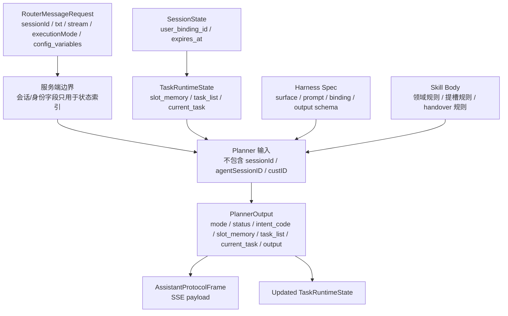
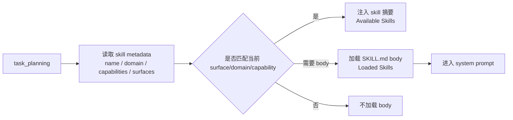
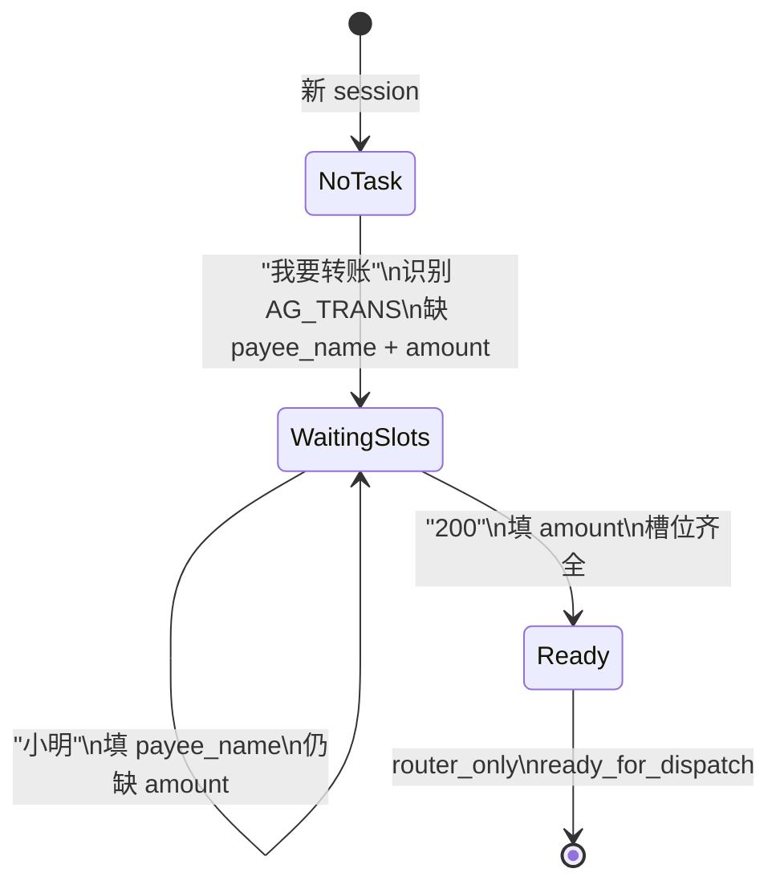
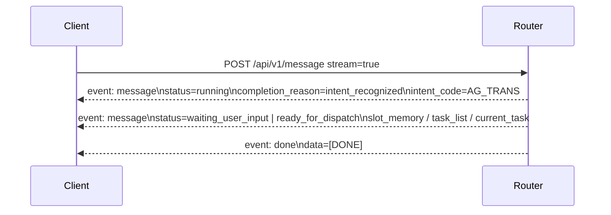
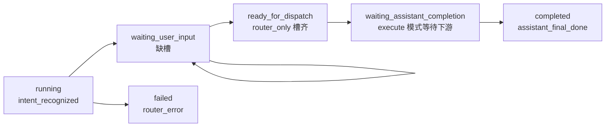

# Intent Router Harness 核心功能设计

本文只描述核心功能设计，不展开 Kubernetes、部署拓扑或外围接口清单。

当前服务的核心目标：

```text
把一条用户消息，带着独立任务运行态，经过 spec + skill + LLM planner，
转成稳定的助手协议流式输出。
```

核心公式：

```text
Message + TaskRuntimeState + Spec Surface + Progressive Skill
  -> LLM Planner
  -> PlannerOutput
  -> Task Runtime Reducer
  -> SSE Frames
```

## 核心功能闭环

```mermaid
flowchart LR
    Input["用户消息\nsessionId + txt + stream"] --> Session["Session 生命周期\n身份绑定 + idle TTL"]
    Session --> Context["上下文组装\n读取 TaskRuntimeState"]
    Context --> Surface["Spec Surface\n选择 task_planning"]
    Surface --> SkillMatch["Skill 渐进式匹配\nmetadata -> body"]
    SkillMatch --> Prompt["Prompt 组装\nsystem + human"]
    Prompt --> LLM["LLM Planner\n识别意图 / 提槽 / 决策状态"]
    LLM --> Validate["结构校验\nPlannerOutput"]
    Validate --> Reduce["Task Runtime Reducer\n合并 slot_memory"]
    Reduce --> Frames["协议帧生成\nrecognition frame + business frame"]
    Frames --> SSE["SSE 输出\nevent: message / done"]
```



这个闭环里，服务代码不硬编码业务提槽规则。服务只负责：

- 读取 session 生命周期元数据
- 读取任务运行态
- 渲染 spec
- 渐进式加载 skill
- 调 LLM
- 校验 LLM 输出
- 合并任务运行态
- 输出 SSE

## 核心对象



### Request

当前核心请求不是候选集驱动，也没有 `primary/candidates`：

```json
{
  "sessionId": "demo_transfer_001",
  "txt": "我要转账",
  "stream": true,
  "executionMode": "router_only",
  "config_variables": []
}
```

### SessionState

session 只负责用户绑定和 30 分钟 idle TTL，不承载任务状态：

```json
{
  "session_id": "demo_transfer_001",
  "user_binding_id": "C0001",
  "expires_at": "2026-05-07T10:30:00Z"
}
```

### TaskRuntimeState

任务运行态才是多轮提槽和任务调度的核心输入：

```json
{
  "slot_memory": {
    "payee_name": "小明"
  },
  "task_list": [],
  "current_task": {
    "taskId": "task_001",
    "intent_code": "AG_TRANS",
    "status": "waiting_user_input"
  }
}
```

### PlannerOutput

LLM planner 必须输出结构化 JSON：

```json
{
  "mode": "slot_filling",
  "status": "waiting_user_input",
  "completion_reason": "router_waiting_user_input",
  "intent_code": "AG_TRANS",
  "recognition": {
    "intent_code": "AG_TRANS"
  },
  "slot_memory": {
    "payee_name": "小明"
  },
  "task_list": [],
  "current_task": null,
  "message": "请提供转账金额",
  "output": {}
}
```

## Spec 驱动设计

Spec 的职责不是写业务规则，而是定义“怎么让 LLM 工作”：

```text
surface = 一个可渲染的任务界面
binding = surface 在什么上下文下加载哪些 skill
prompt = LLM 的工作协议和输出约束
```

当前主 surface 是：

```text
task_planning
```

它负责让 LLM 一次完成：

- 意图识别
- 多轮上下文理解
- 提槽判断
- 状态决策
- PlannerOutput JSON 生成

Spec 中固定的协议约束包括：

- 只能输出允许的 `status`
- 缺槽不能 `ready_for_dispatch`
- 槽齐且 `router_only` 才能 `ready_for_dispatch`
- `slot_memory` 不能放进 `output`
- 不允许输出 `pending`
- 不允许复制 schema 辅助字段

## Skill 渐进式加载设计



渐进式加载分两层：

| 阶段 | 作用 |
| --- | --- |
| metadata | 让 LLM 知道有哪些可用 skill |
| body | 只把当前 surface 需要的 skill 正文加载进 prompt |

当前金融场景加载：

```text
finance-routing/SKILL.md
```

它提供：

- `AG_TRANS` 的标准意图码
- 必填槽位定义
- 短答补槽规则
- 多轮槽位继承规则
- handover 规则

## 提槽设计

提槽不是 Python 正则完成的，而是 skill 规则注入后由 LLM planner 完成。



### 规则来源

`finance-routing/SKILL.md` 定义：

```text
AG_TRANS.required_slots = payee_name, amount
短人名回复 -> payee_name
数字/金额回复 -> amount
保留任务运行态中已有槽位
缺槽 -> waiting_user_input
槽齐 -> ready_for_dispatch
```

### 服务层只做状态合并

服务层不判断“小明是不是收款人”，只合并 LLM 输出：

```python
slot_memory = dict(task_runtime.slot_memory)
slot_memory.update(plan.slot_memory)
```

这保证了业务规则仍然在 skill，而不是散落到服务代码里。

## 流式协议设计

每次 `/api/v1/message` 在可识别场景下输出两类业务帧：



### 识别帧

```json
{
  "status": "running",
  "intent_code": "AG_TRANS",
  "completion_reason": "intent_recognized",
  "stage": "intent_recognition"
}
```

### 业务帧：缺槽

```json
{
  "status": "waiting_user_input",
  "intent_code": "AG_TRANS",
  "completion_reason": "router_waiting_user_input",
  "slot_memory": {
    "payee_name": "小明"
  },
  "message": "请提供转账金额"
}
```

### 业务帧：槽齐

```json
{
  "status": "ready_for_dispatch",
  "intent_code": "AG_TRANS",
  "completion_reason": "router_ready_for_dispatch",
  "slot_memory": {
    "payee_name": "小明",
    "amount": "200"
  },
  "output": {}
}
```

## 状态机



允许的状态：

```text
running
waiting_user_input
ready_for_dispatch
waiting_assistant_completion
completed
cancelled
failed
```

## 当前边界

### 当前做了

- spec 驱动 prompt
- skill 渐进式加载
- LLM planner 识别意图和提槽
- session 内存上下文
- SSE 流式输出
- LLM 原始分析日志
- 回归协议校验

### 当前没做

- 没有 Redis / DB session 持久化
- 没有 Python 业务正则提槽
- 没有候选意图输入
- 没有 `primary/candidates`
- 没有把 skill 变成代码执行器

## 设计原则

1. **服务层保持薄**
   服务层不放业务规则，只做编排、状态保存和协议适配。

2. **领域规则进 skill**
   意图边界、槽位定义、补槽策略、handover 语义都写进 `SKILL.md`。

3. **输出协议由 spec 约束**
   状态机、JSON 字段、错误边界由 surface prompt 和 Pydantic schema 双重约束。

4. **LLM 是 planner，不是自由聊天**
   LLM 只能输出 `PlannerOutput`，服务只接受结构化结果。

5. **流式优先**
   主接口默认面向 SSE，非流式只是兼容模式。
