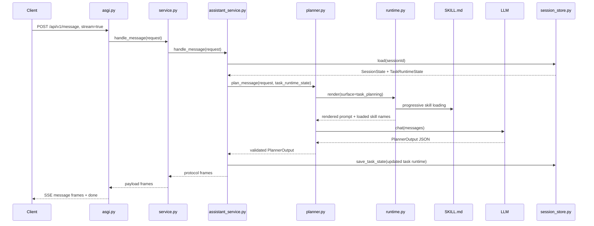
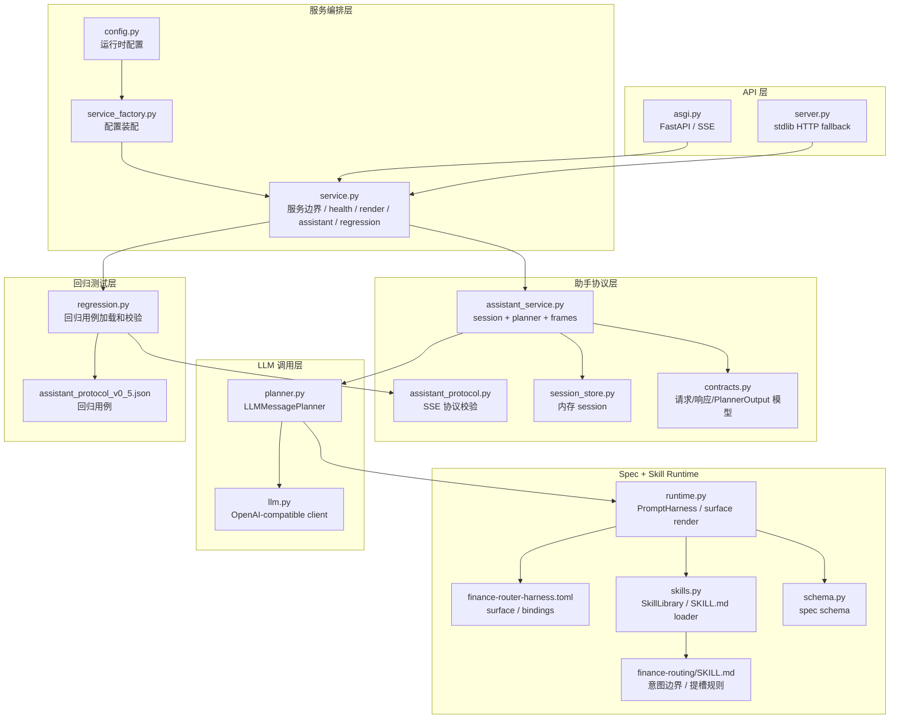
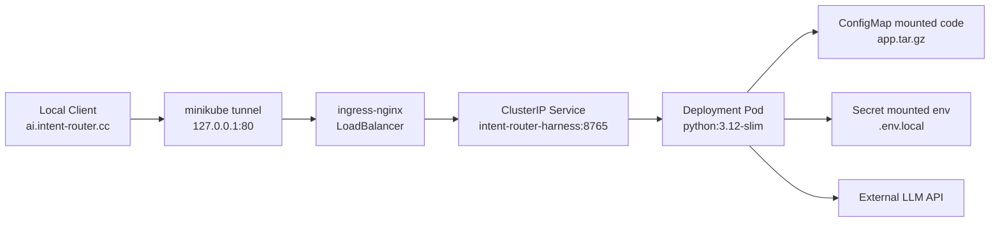

# Intent Router Harness 当前服务架构

本文记录当前服务的实际边界：这是一个 **意图识别 + spec 驱动 + skill 渐进式加载 + LLM planner + SSE 协议输出** 的服务。

当前没有 `primary/candidates` 输出，也没有 `candidate_intents` 输入。提槽规则放在 skill 中，服务层只负责 session 生命周期、任务运行态保存、prompt 渲染、LLM 调用和协议适配。

## 总体架构

```mermaid
flowchart LR
    Client[Client / Mock Assistant] -->|POST /api/v1/message\nstream=true| Ingress[Ingress\nai.intent-router.cc]
    Ingress --> ASGI[FastAPI ASGI\nasgi.py]
    ASGI --> Service[IntentRouterHarnessService\nservice.py]
    Service --> Assistant[AssistantProtocolService\nassistant_service.py]
    Assistant --> Session[InMemorySessionStore\nsession_store.py]
    Assistant --> Planner[LLMMessagePlanner\nplanner.py]
    Planner --> Runtime[PromptHarness\nruntime.py]
    Runtime --> Spec[Harness Spec\nexamples/finance-router-harness.toml]
    Runtime --> SkillLib[SkillLibrary\nskills.py]
    SkillLib --> Skill[finance-routing/SKILL.md\n提槽/领域规则]
    Planner --> LLM[OpenAI-compatible LLM\nllm.py]
    LLM --> Planner
    Planner --> Assistant
    Assistant -->|AssistantProtocolFrame[]| Service
    Service --> ASGI
    ASGI -->|SSE event: message / done| Client
```

## 请求处理流程



## 模块图



## 职责边界

| 层级 | 模块 | 职责 |
| --- | --- | --- |
| API | `asgi.py` | 暴露 `/api/v1/message`、`/api/v1/task/completion`、health、render、regression 接口；负责 SSE 输出。 |
| 服务 | `service.py` | 服务总入口，连接 prompt harness、assistant protocol、LLM、regression。 |
| 协议 | `assistant_service.py` | 读取 session 生命周期和 task runtime，调用 planner，把 `PlannerOutput` 转为协议帧。 |
| 会话 | `session_store.py` | 当前为进程内内存存储；session 只保存身份和 30 分钟空闲 TTL，任务状态在独立 `TaskRuntimeState` 中保存。 |
| Planner | `planner.py` | 渲染 `task_planning` surface，调用 LLM，校验 LLM JSON。 |
| Runtime | `runtime.py` | 根据 spec surface 和上下文渐进式加载 skill，生成 system/human prompt。 |
| Skill | `skills/finance-routing/SKILL.md` | 金融领域规则，包含 `AG_TRANS` 的提槽规则和槽位边界。 |
| LLM | `llm.py` | OpenAI-compatible chat completion client。 |
| 回归 | `regression.py` / `assistant_protocol.py` | 加载测试用例并校验 SSE 协议输出。 |

## 提槽位置

提槽规则在 `skills/finance-routing/SKILL.md` 中定义：

- `AG_TRANS` 必填槽位：`payee_name`、`amount`
- 短答 `"小明"` 这类文本填 `payee_name`
- 数字或金额表达 `"200"`、`"200元"` 填 `amount`
- 已有槽位从 `task_state_json` 中的当前任务运行态继承并合并
- 槽缺失时返回 `waiting_user_input`
- 槽齐且 `router_only` 时返回 `ready_for_dispatch`

服务层不硬编码正则提槽逻辑，只保存 LLM 返回的 `slot_memory`：

```python
slot_memory = dict(current_task.slot_memory)
slot_memory.update(plan.slot_memory)
```

## 部署视图



## 关键日志

查看渐进式加载和 LLM 分析：

```bash
kubectl -n intent logs deploy/intent-router-harness -f | rg 'spec\.|llm\.plan'
```

典型日志：

```text
spec.progressive_load surface=task_planning metadata_skills=['finance-routing'] body_skills=['finance-routing']
spec.loaded_skill_body surface=task_planning skill=finance-routing ...
llm.plan.prompt_rendered session_id=...
llm.plan.raw_response session_id=... content=...
llm.plan.parsed_json session_id=...
llm.plan.validated session_id=... status=waiting_user_input intent_code=AG_TRANS
```
